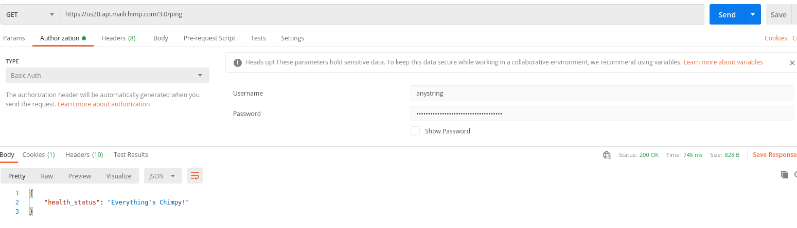
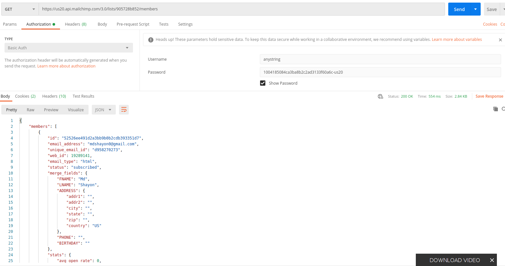
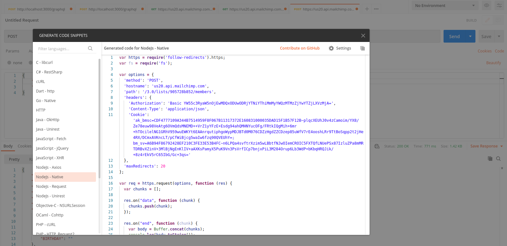

 - [Tutorial](https://www.youtube.com/watch?v=CAPaHp7l1-I&list=PLpPnRKq7eNW08GdKgS3ar2kg9-CiYWxN2&index=6)
 - [Make your first api call](https://mailchimp.com/developer/guides/marketing-api-quick-start/#make-your-first-api-call) Using mac curl

```
curl -sS \
  "https://us20.api.mailchimp.com/3.0/ping" \
  --user "`anystring`:1004185084ca3ba8b2c2ad3133f60a6c-us20" | jq -r
```

- Api call using postman **password will be our api key and user name is anystring**

  
  

 - Make a get request with __https://us20.api.mailchimp.com/3.0/__


 - Do something with [audiance or list](https://mailchimp.com/developer/api/marketing/lists/) api referance

 - Word with [memebers of list/audiance](https://mailchimp.com/developer/api/marketing/list-members/list-members-info/)

 

 - [Add mamaber to the list](https://mailchimp.com/developer/api/marketing/list-members/add-member-to-list/)
 - In postman right side there is a option **code** -> click and get code for node.js ->use in our project

  

